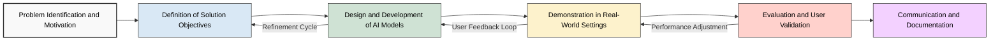

```mermaid
graph LR
    A[Problem Identification and Motivation] --> B[Definition of Solution Objectives]
    B --> C[Design and Development of AI Models]
    C --> D[Demonstration in Real-World Settings]
    D --> E[Evaluation and User Validation]
    E --> F[Communication and Documentation]

    %% Iterative arrows for feedback and improvement cycles
    C -->|Refinement Cycle| B
    D -->|User Feedback Loop| C
    E -->|Performance Adjustment| D

    %% Style adjustments for clarity
    style A fill:#f9f9f9,stroke:#333,stroke-width:2px, color:#000
    style B fill:#d9e8f5,stroke:#333,stroke-width:1px, color:#000
    style C fill:#cfe2d4,stroke:#333,stroke-width:1px, color:#000
    style D fill:#fdf2cc,stroke:#333,stroke-width:1px, color:#000
    style E fill:#ffd1cc,stroke:#333,stroke-width:1px, color:#000
    style F fill:#f3d1ff,stroke:#333,stroke-width:1px, color:#000
```