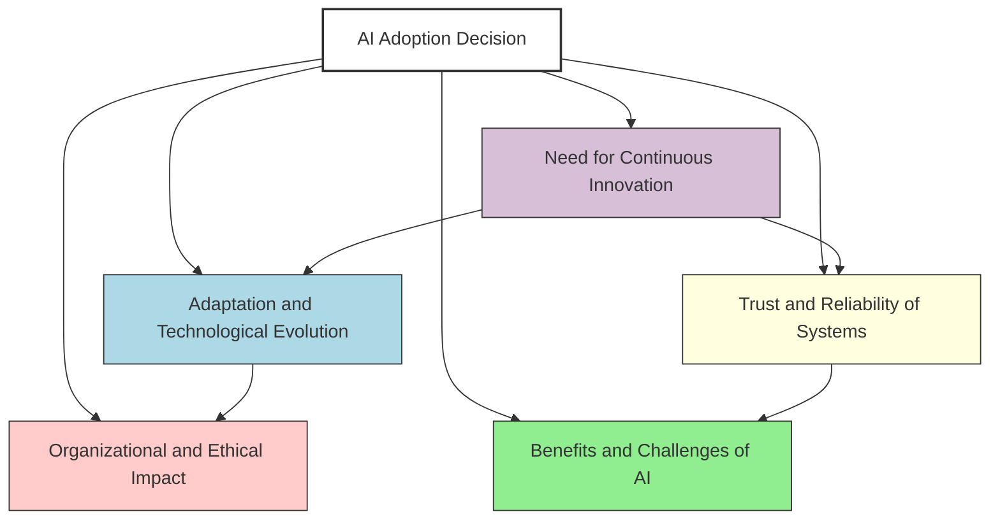

```mermaid
%% Define o tema claro
%% Escolha as cores para os nós específicos
graph TB
style A fill:#ffffff,stroke:#333,stroke-width:2px
style B fill:#add8e6,stroke:#333,stroke-width:1px
style C fill:#90ee90,stroke:#333,stroke-width:1px
style D fill:#ffffe0,stroke:#333,stroke-width:1px
style E fill:#ffcccb,stroke:#333,stroke-width:1px
style F fill:#d8bfd8,stroke:#333,stroke-width:1px
A[AI Adoption Decision] --> B[Adaptation and Technological Evolution]
A --> C[Benefits and Challenges of AI]
A --> D[Trust and Reliability of Systems]
A --> E[Organizational and Ethical Impact]
A --> F[Need for Continuous Innovation]

B --> E
D --> C
F --> B
F --> D
```
