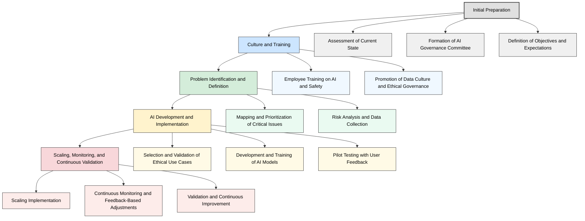

```mermaid
%% Layout vertical com subetapas à direita e cores ajustadas para clareza
graph TD
style A fill:#e0e0e0,stroke:#333,stroke-width:2px,color:#000
style B fill:#cce5ff,stroke:#333,stroke-width:1px,color:#000
style C fill:#d4edda,stroke:#333,stroke-width:1px,color:#000
style D fill:#fff3cd,stroke:#333,stroke-width:1px,color:#000
style E fill:#f8d7da,stroke:#333,stroke-width:1px,color:#000

%% Main stages in vertical layout
A[Initial Preparation] --> B[Culture and Training]
B --> C[Problem Identification and Definition]
C --> D[AI Development and Implementation]
D --> E[Scaling, Monitoring, and Continuous Validation]

%% Initial Preparation steps extending to the right
style A1 fill:#f0f0f0,stroke:#333,stroke-width:1px,color:#000
style A2 fill:#f0f0f0,stroke:#333,stroke-width:1px,color:#000
style A3 fill:#f0f0f0,stroke:#333,stroke-width:1px,color:#000
A --> A1[Assessment of Current State]
A --> A2[Formation of AI Governance Committee]
A --> A3[Definition of Objectives and Expectations]

%% Culture and Training steps extending to the right
style B1 fill:#f0f8ff,stroke:#333,stroke-width:1px,color:#000
style B2 fill:#f0f8ff,stroke:#333,stroke-width:1px,color:#000
B --> B1[Employee Training on AI and Safety]
B --> B2[Promotion of Data Culture and Ethical Governance]

%% Problem Identification and Definition steps extending to the right
style C1 fill:#eafaf1,stroke:#333,stroke-width:1px,color:#000
style C2 fill:#eafaf1,stroke:#333,stroke-width:1px,color:#000
C --> C1[Mapping and Prioritization of Critical Issues]
C --> C2[Risk Analysis and Data Collection]

%% AI Development and Implementation steps extending to the right
style D1 fill:#fffae6,stroke:#333,stroke-width:1px,color:#000
style D2 fill:#fffae6,stroke:#333,stroke-width:1px,color:#000
style D3 fill:#fffae6,stroke:#333,stroke-width:1px,color:#000
D --> D1[Selection and Validation of Ethical Use Cases]
D --> D2[Development and Training of AI Models]
D --> D3[Pilot Testing with User Feedback]

%% Scaling, Monitoring, and Continuous Validation steps extending to the right
style E1 fill:#fdecea,stroke:#333,stroke-width:1px,color:#000
style E2 fill:#fdecea,stroke:#333,stroke-width:1px,color:#000
style E3 fill:#fdecea,stroke:#333,stroke-width:1px,color:#000
E --> E1[Scaling Implementation]
E --> E2[Continuous Monitoring and Feedback-Based Adjustments]
E --> E3[Validation and Continuous Improvement]
```