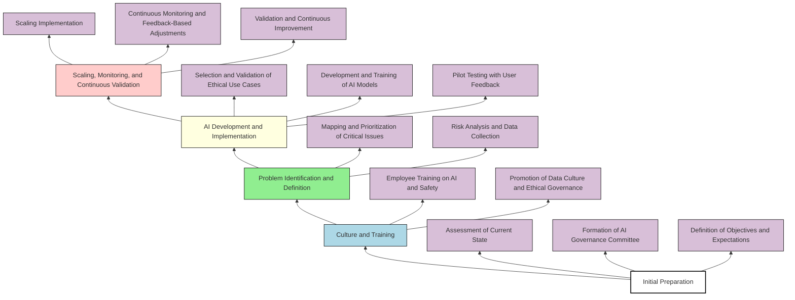

```mermaid
%% Layout tipo mapa de processo com blocos verticais
graph BT
style A fill:#ffffff,stroke:#000,stroke-width:2px
style B fill:#add8e6,stroke:#000,stroke-width:1px
style C fill:#90ee90,stroke:#000,stroke-width:1px
style D fill:#ffffe0,stroke:#000,stroke-width:1px
style E fill:#ffcccb,stroke:#000,stroke-width:1px

%% Main stages in a bottom tree layout
A[Initial Preparation] --> B[Culture and Training]
B --> C[Problem Identification and Definition]
C --> D[AI Development and Implementation]
D --> E[Scaling, Monitoring, and Continuous Validation]

%% Initial Preparation steps in bottom tree layout
style A1 fill:#d8bfd8,stroke:#000,stroke-width:1px
style A2 fill:#d8bfd8,stroke:#000,stroke-width:1px
style A3 fill:#d8bfd8,stroke:#000,stroke-width:1px
A --> A1[Assessment of Current State]
A --> A2[Formation of AI Governance Committee]
A --> A3[Definition of Objectives and Expectations]

%% Culture and Training steps in bottom tree layout
style B1 fill:#d8bfd8,stroke:#000,stroke-width:1px
style B2 fill:#d8bfd8,stroke:#000,stroke-width:1px
B --> B1[Employee Training on AI and Safety]
B --> B2[Promotion of Data Culture and Ethical Governance]

%% Problem Identification and Definition steps in bottom tree layout
style C1 fill:#d8bfd8,stroke:#000,stroke-width:1px
style C2 fill:#d8bfd8,stroke:#000,stroke-width:1px
C --> C1[Mapping and Prioritization of Critical Issues]
C --> C2[Risk Analysis and Data Collection]

%% AI Development and Implementation steps in bottom tree layout
style D1 fill:#d8bfd8,stroke:#000,stroke-width:1px
style D2 fill:#d8bfd8,stroke:#000,stroke-width:1px
style D3 fill:#d8bfd8,stroke:#000,stroke-width:1px
D --> D1[Selection and Validation of Ethical Use Cases]
D --> D2[Development and Training of AI Models]
D --> D3[Pilot Testing with User Feedback]

%% Scaling, Monitoring, and Continuous Validation steps in bottom tree layout
style E1 fill:#d8bfd8,stroke:#000,stroke-width:1px
style E2 fill:#d8bfd8,stroke:#000,stroke-width:1px
style E3 fill:#d8bfd8,stroke:#000,stroke-width:1px
E --> E1[Scaling Implementation]
E --> E2[Continuous Monitoring and Feedback-Based Adjustments]
E --> E3[Validation and Continuous Improvement]
```