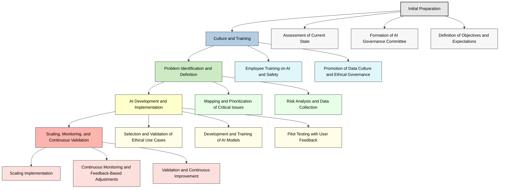

```mermaid
%% Layout vertical estruturado do planejamento à implementação
graph TD
style A fill:#e6e6e6,stroke:#333,stroke-width:2px,color:#000
style B fill:#b3cde3,stroke:#333,stroke-width:1px,color:#000
style C fill:#ccebc5,stroke:#333,stroke-width:1px,color:#000
style D fill:#ffffcc,stroke:#333,stroke-width:1px,color:#000
style E fill:#fbb4ae,stroke:#333,stroke-width:1px,color:#000

%% Etapas principais
A[Initial Preparation] --> B[Culture and Training]
B --> C[Problem Identification and Definition]
C --> D[AI Development and Implementation]
D --> E[Scaling, Monitoring, and Continuous Validation]

%% Detalhamento da preparação inicial com subetapas à direita
style A1 fill:#f7f7f7,stroke:#333,stroke-width:1px,color:#000
style A2 fill:#f7f7f7,stroke:#333,stroke-width:1px,color:#000
style A3 fill:#f7f7f7,stroke:#333,stroke-width:1px,color:#000
A --> A1[Assessment of Current State]
A --> A2[Formation of AI Governance Committee]
A --> A3[Definition of Objectives and Expectations]

%% Detalhamento de Cultura e Treinamento com subetapas à direita
style B1 fill:#e0f7fa,stroke:#333,stroke-width:1px,color:#000
style B2 fill:#e0f7fa,stroke:#333,stroke-width:1px,color:#000
B --> B1[Employee Training on AI and Safety]
B --> B2[Promotion of Data Culture and Ethical Governance]

%% Detalhamento de Identificação de Problemas e Definição com subetapas à direita
style C1 fill:#e6ffe6,stroke:#333,stroke-width:1px,color:#000
style C2 fill:#e6ffe6,stroke:#333,stroke-width:1px,color:#000
C --> C1[Mapping and Prioritization of Critical Issues]
C --> C2[Risk Analysis and Data Collection]

%% Detalhamento de Desenvolvimento e Implementação de IA com subetapas à direita
style D1 fill:#fffde7,stroke:#333,stroke-width:1px,color:#000
style D2 fill:#fffde7,stroke:#333,stroke-width:1px,color:#000
style D3 fill:#fffde7,stroke:#333,stroke-width:1px,color:#000
D --> D1[Selection and Validation of Ethical Use Cases]
D --> D2[Development and Training of AI Models]
D --> D3[Pilot Testing with User Feedback]

%% Detalhamento de Escala, Monitoramento e Validação Contínua com subetapas à direita
style E1 fill:#fde0dd,stroke:#333,stroke-width:1px,color:#000
style E2 fill:#fde0dd,stroke:#333,stroke-width:1px,color:#000
style E3 fill:#fde0dd,stroke:#333,stroke-width:1px,color:#000
E --> E1[Scaling Implementation]
E --> E2[Continuous Monitoring and Feedback-Based Adjustments]
E --> E3[Validation and Continuous Improvement]

```